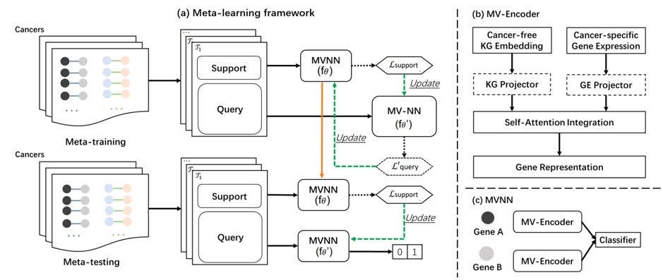

# Meta Learning for Low-Data Prediction of Cancer-specific Synthetic Lethality as Drug Targets

**Meta-CapSL** (Meta-learning for predicting Cancer-specific Synthetic Lethality) is a novel deep learning framework designed to predict potential cancer-specific synthetic lethal (SL) gene pairs under extreme data scarcity. By integrating multi-modal biological knowledge and leveraging meta-learning, Meta-CapSL enables accurate SL prediction even when only a few labeled examples are available for a new cancer type.



## 🌟 Key Features
- **Few-shot adaptation**: Learns transferable synthetic lethality patterns across cancer types via meta-learning, enabling effective adaptation to cancer types with limited SL gene pairs.
- **Attention-based multi-modal fusion**: Integrates biomedical knowledge graph–derived gene representations with cancer-specific gene expression features through a self-attention–based fusion mechanism.
---

## 📊 Dataset

- **Cancer-specific SL labels**:  
  32,561 experimentally supported SL gene pairs involving 9,516 unique genes across multiple cancer types.
  
- **PrimeKG (Knowledge Graph)**:  
  A comprehensive biomedical knowledge graph containing:
  - **54,012 nodes** of 11 entity types (genes, diseases, drugs, etc.)
  - **2,231,921 edges** representing 24 relation types

---

## ⚙️ Environment & Requirements

> ✅ **This project is developed and tested on CUDA 10.2.**  
> For best compatibility and performance, we strongly recommend using **CUDA 10.2 with cuDNN 7.6.5** and **NVIDIA driver ≥ 440.33**.

### Python Dependencies
Install required packages via:

```bash
pip install -r requirements.txt
```


## ▶ Quick Start

### 1. Meta-Pretraining (on source cancer types)

Trains the model using a meta-learning framework to learn transferable knowledge.

```bash
python script/run_meta_train.py --exp_name=meta_training --exp_root='./meta_training'
```

### 2. Meta-Testing (on a new target cancer type)
Evaluates few-shot adaptation performance on a previously unseen cancer type with limited labels:
```bash
python script/run_meta_test.py --exp_name=meta_testing  --exp_root='meta_testing' --pretrain_model_dir='./meta_training/meta_training/model/'
```

## 📜 License
This codebase is released under the MIT License as in  [LICENSE](LICENSE) file.
